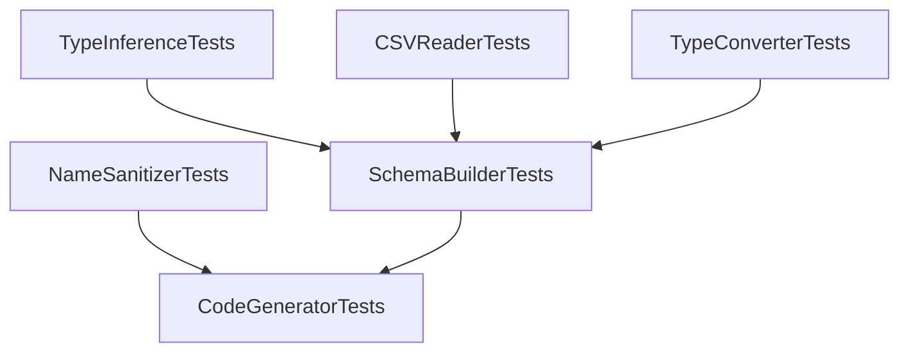

# Testing Guide - Data to ScriptableObject

## Machine-Readable Testing Process

### Test Configuration
```yaml
test_framework: NUnit
unity_version: "2021.3+"
test_mode: Unity Test Runner (EditMode)
test_directory: Tests/Editor/
test_assembly: DataToScriptableObject.Tests.Editor.asmdef
```

### Test Execution Priority

#### Phase 1: Unit Tests (Fast - ~1-2 seconds)
Run these first for quick feedback:
```yaml
priority: 1
execution_time: fast
test_files:
  - NameSanitizerTests.cs       # 12 tests - identifier sanitization
  - TypeInferenceTests.cs        # 11 tests - type detection
  - TypeConverterTests.cs        # 10 tests - type conversion
  - GoogleSheetsURLParserTests.cs # 11 tests - URL parsing

estimated_time: 1-2 seconds
commands:
  - "Unity -runTests -testPlatform EditMode -testFilter NameSanitizerTests"
  - "Unity -runTests -testPlatform EditMode -testFilter TypeInferenceTests"
```

#### Phase 2: Parser Tests (Medium - ~2-5 seconds)
CSV parsing and schema building:
```yaml
priority: 2
execution_time: medium
test_files:
  - CSVReaderTests.cs           # 16 tests - CSV parsing
  - SchemaBuilderTests.cs       # 12 tests - schema construction

estimated_time: 2-5 seconds
commands:
  - "Unity -runTests -testPlatform EditMode -testFilter CSVReaderTests"
  - "Unity -runTests -testPlatform EditMode -testFilter SchemaBuilderTests"
```

#### Phase 3: Generator Tests (Slow - ~5-10 seconds)
Code generation and integration:
```yaml
priority: 3
execution_time: slow
test_files:
  - CodeGeneratorTests.cs       # 12 tests - code generation

estimated_time: 5-10 seconds
commands:
  - "Unity -runTests -testPlatform EditMode -testFilter CodeGeneratorTests"
```

### Test Dependencies and Ordering



### Known Test Failure Patterns

#### Pattern 1: Type Inference Issues
```yaml
symptom: "Expected: Int, But was: Bool"
root_causes:
  - BooleanValues array includes numeric strings ("1", "0")
  - Single row inference defaults incorrectly
affected_tests:
  - TypeInferenceTests.TestBoolWith01
  - SchemaBuilderTests.TestSingleRowHeader
fix_location: Editor/Core/TypeInference.cs
```

#### Pattern 2: Name Sanitization Issues  
```yaml
symptom: "Expected: 'id', But was: 'iD'"
root_causes:
  - ConvertToCase doesn't handle all-caps words properly
  - Case conversion only affects first character
affected_tests:
  - NameSanitizerTests.TestAllCapsToLower
fix_location: Editor/Core/NameSanitizer.cs
```

#### Pattern 3: CSV Parsing Issues
```yaml
symptom: "Expected: 2, But was: 0 (directives/rows)"
root_causes:
  - Directive detection logic
  - Quote escaping in ParseLine
  - Comment prefix conflicts with directives
affected_tests:
  - CSVReaderTests.TestDirectivesParsed
  - CSVReaderTests.TestEscapedDoubleQuotes
  - CSVReaderTests.TestParseBasicCSV
fix_location: Editor/Core/CSVReader.cs
```

#### Pattern 4: Schema Building Issues
```yaml
symptom: "Expected: 'column_0', But was: 'name'"
root_causes:
  - OriginalHeader uses raw header instead of normalized
  - Enum values not collected from full flags row
  - Directive parsing failures from CSVReader
affected_tests:
  - SchemaBuilderTests.TestEmptyHeader
  - SchemaBuilderTests.TestDuplicateHeaders
  - SchemaBuilderTests.TestEnumParsing
  - SchemaBuilderTests.TestDirectivesOverride
fix_location: Editor/Core/SchemaBuilder.cs
```

#### Pattern 5: Code Generation Issues
```yaml
symptom: "Assert.IsTrue(code.Contains('enum')) failed"
root_causes:
  - Enum declarations not generated
  - Missing enum type before class definition
affected_tests:
  - CodeGeneratorTests.TestEnumGeneration
fix_location: Editor/Core/CodeGenerator.cs
```

### Test Efficiency Tips

#### 1. Run Affected Tests Only
```bash
# After changing TypeInference.cs
Unity -runTests -testFilter "TypeInferenceTests|SchemaBuilderTests"

# After changing CSVReader.cs
Unity -runTests -testFilter "CSVReaderTests|SchemaBuilderTests"

# After changing CodeGenerator.cs
Unity -runTests -testFilter "CodeGeneratorTests"
```

#### 2. Parallel Test Execution
```yaml
strategy: split_by_test_file
parallel_groups:
  group_1: [NameSanitizerTests, TypeInferenceTests, TypeConverterTests]
  group_2: [CSVReaderTests, GoogleSheetsURLParserTests]
  group_3: [SchemaBuilderTests, CodeGeneratorTests]
```

#### 3. Fast Failure Detection
```bash
# Run fastest tests first (unit tests)
# Stop on first failure for rapid iteration
Unity -runTests -testFilter "NameSanitizerTests|TypeInferenceTests" -stopOnFailure
```

### Test Coverage Map

```yaml
component: CSVReader
test_file: CSVReaderTests.cs
test_count: 16
coverage_areas:
  - basic_parsing: [TestParseBasicCSV, TestParseSemicolonDelimiter, TestParseTabDelimiter]
  - delimiter_detection: [TestAutoDetectComma, TestAutoDetectSemicolon]
  - quoted_fields: [TestQuotedFieldWithComma, TestQuotedFieldWithNewline, TestEscapedDoubleQuotes]
  - special_handling: [TestBOMStripped, TestCommentLinesSkipped, TestDirectivesParsed]
  - edge_cases: [TestEmptyFile, TestMismatchedColumns, TestEmptyRowsSkipped]
  - line_endings: [TestWindowsLineEndings, TestMacLineEndings]

component: SchemaBuilder
test_file: SchemaBuilderTests.cs
test_count: 12
coverage_areas:
  - header_modes: [TestSingleRowHeader, TestTwoRowHeader, TestBasicThreeRowHeader]
  - type_parsing: [TestEnumParsing]
  - attribute_parsing: [TestRangeParsing, TestTooltipParsing]
  - flags: [TestSkipColumn, TestKeyAndName]
  - directives: [TestDirectivesOverride]
  - edge_cases: [TestDuplicateHeaders, TestEmptyHeader, TestUnrecognizedType]

component: CodeGenerator
test_file: CodeGeneratorTests.cs
test_count: 12
coverage_areas:
  - basic_generation: [TestBasicGeneration, TestNamespaceWrapping]
  - modes: [TestSerializableClassMode, TestSerializeFieldMode]
  - types: [TestListGeneration, TestArrayGeneration, TestEnumGeneration]
  - attributes: [TestRangeAttribute, TestTooltipAttribute]
  - metadata: [TestCreateAssetMenu, TestAutoGeneratedHeader, TestDatabaseClassGeneration]

component: TypeInference
test_file: TypeInferenceTests.cs
test_count: 11
coverage_areas:
  - numeric_types: [TestAllInts, TestAllFloats, TestMixedIntFloat]
  - boolean_types: [TestAllBools, TestBoolWithYesNo, TestBoolWith01]
  - fallback_logic: [TestOneBadIntFallsToFloat, TestOneBadFloatFallsToString]
  - empty_handling: [TestEmptyColumnInfersString, TestNullColumnInfersString]

component: NameSanitizer
test_file: NameSanitizerTests.cs
test_count: 12
coverage_areas:
  - case_conversion: [TestSpaceToCamel, TestSnakeToCamel, TestAllCapsToLower]
  - special_characters: [TestLeadingDigit, TestSpecialChars, TestHyphen]
  - reserved_words: [TestReservedWord]
  - edge_cases: [TestMultipleSpaces, TestUnicode, TestEmptyString, TestOnlySpecialChars]
```

### Debugging Failed Tests

#### Step 1: Identify Failure Pattern
```bash
# Extract failure info from test results
grep "result=\"Failed\"" TestResults*.xml -A 5
```

#### Step 2: Locate Root Cause
Use the failure pattern mapping above to identify likely file locations.

#### Step 3: Verify Fix Scope
```yaml
if: TypeInference or NameSanitizer change
  retest: Unit tests + SchemaBuilder
  
if: CSVReader change
  retest: CSVReaderTests + SchemaBuilderTests
  
if: SchemaBuilder change
  retest: SchemaBuilderTests + CodeGeneratorTests
  
if: CodeGenerator change
  retest: CodeGeneratorTests only
```

#### Step 4: Validate Full Suite
After individual test fixes pass, run full suite:
```bash
Unity -runTests -testPlatform EditMode
```

### Adding New Tests

#### Test Checklist
- [ ] Test name clearly describes scenario
- [ ] Test is in correct file by component
- [ ] Test follows existing assertion patterns
- [ ] Test data uses realistic CSV formats
- [ ] Test includes expected and actual value checks
- [ ] Test covers edge case or regression

#### Recommended New Tests

```yaml
high_priority_additions:
  - CSVReaderTests.TestMultilineQuotedField: |
      Test fields with multiple line breaks within quotes
      
  - TypeInferenceTests.TestVector2Inference: |
      Test automatic detection of Vector2 from "(x,y)" format
      
  - SchemaBuilderTests.TestMultipleEnumsInSameTable: |
      Test handling of multiple enum columns
      
  - CodeGeneratorTests.TestEnumWithDuplicateValues: |
      Test enum generation with duplicate value names
      
  - NameSanitizerTests.TestFieldNameCollisions: |
      Test handling when sanitization creates duplicates

medium_priority_additions:
  - CSVReaderTests.TestVeryLargeFile: |
      Performance test with 10,000+ rows
      
  - SchemaBuilderTests.TestInvalidDirectiveSyntax: |
      Test error handling for malformed directives
      
  - CodeGeneratorTests.TestNamespaceCollisions: |
      Test when generated class conflicts with existing namespace
```

### Performance Benchmarks

```yaml
target_performance:
  unit_tests: "<2 seconds for all 44 tests"
  parser_tests: "<5 seconds for 28 tests"
  generator_tests: "<10 seconds for 12 tests"
  full_suite: "<20 seconds for all 91 tests"

performance_regression_triggers:
  unit_tests: ">3 seconds"
  parser_tests: ">8 seconds"
  full_suite: ">30 seconds"
```

### Continuous Integration

```yaml
ci_pipeline:
  on_pull_request:
    - run: fast_tests (unit tests)
    - condition: fast_tests_pass
      run: medium_tests (parser tests)
    - condition: medium_tests_pass
      run: slow_tests (generator tests)
      
  on_merge:
    - run: full_test_suite
    - run: performance_benchmarks
    - generate: coverage_report
```

### Test Result Interpretation

```yaml
exit_codes:
  0: All tests passed
  1: One or more tests failed
  2: Test runner error
  3: Compilation error

failure_severity:
  critical: [CSVReaderTests, SchemaBuilderTests]
    reason: "Core functionality broken"
    
  high: [TypeInferenceTests, CodeGeneratorTests]
    reason: "Incorrect output generated"
    
  medium: [NameSanitizerTests, TypeConverterTests]
    reason: "Edge cases or formatting issues"
    
  low: [GoogleSheetsURLParserTests]
    reason: "Optional feature affected"
```

### Test Maintenance

```yaml
review_frequency: quarterly
maintenance_tasks:
  - Update test data for new Unity versions
  - Add regression tests for reported bugs
  - Remove obsolete tests for deprecated features
  - Update performance benchmarks
  - Review and update this guide
```

## Quick Reference

### Run All Tests
```bash
Unity -runTests -testPlatform EditMode
```

### Run Single Test File
```bash
Unity -runTests -testFilter "CSVReaderTests"
```

### Run Specific Test
```bash
Unity -runTests -testFilter "CSVReaderTests.TestParseBasicCSV"
```

### Generate Test Report
```bash
Unity -runTests -testResults ./TestResults.xml
```

### Common Issues

| Symptom | Likely Cause | Quick Fix |
|---------|-------------|-----------|
| All tests fail | Assembly not found | Check .asmdef files |
| Random failures | Race conditions | Add delays or mocking |
| Tests pass locally, fail in CI | Environment differences | Check Unity version, packages |
| Slow test execution | Large test data | Use smaller datasets or pagination |

---

**Last Updated**: 2026-02-07  
**Test Suite Version**: 1.0  
**Total Tests**: 91  
**Current Pass Rate**: 80/91 (87.9%)
