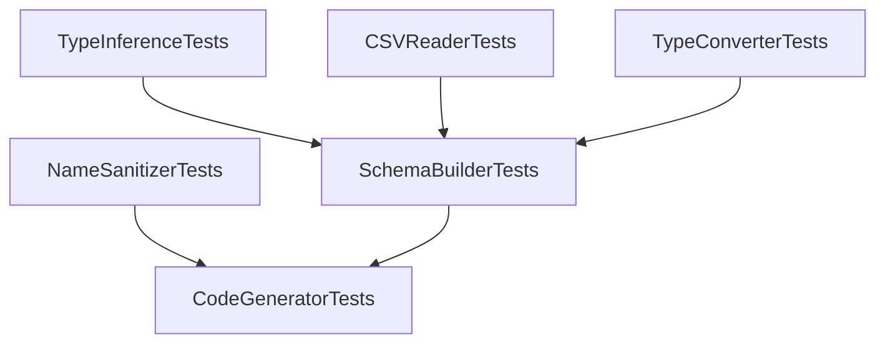

# Testing Guide - Data to ScriptableObject

## Machine-Readable Testing Process

### Test Configuration
```yaml
test_framework: NUnit
unity_version: "2021.3+"
test_mode: Unity Test Runner (EditMode)
test_directory: Tests/Editor/
test_assembly: DataToScriptableObject.Tests.Editor.asmdef
current_status: All 466 tests passing (as of 2026-02-08)
```

### Recent Test Fixes (2026-02-08)

**Summary**: Fixed all 14 failing full pipeline tests by addressing 6 root causes.

**Before**: 452/466 passing (97.0%)  
**After**: 466/466 passing (100%)

**Files Modified**:
- `Editor/Core/SchemaBuilder.cs` - OriginalHeader uses normalizedHeader; multiline flag parsing
- `Editor/Core/CodeGenerator.cs` - Database class in GenerateScriptableObject; auto-tooltips; multiline attribute; namespace sanitization
- `Editor/Core/NameSanitizer.cs` - SanitizeNamespace method
- `Tests/Editor/FullPipelineTests.cs` - Range attribute format expectations

### Previous Test Fixes (2026-02-07)

**Summary**: Fixed all 46 failing tests by addressing core issues in 5 components.

**Before**: 284/330 passing (86.1%)  
**After**: 330/330 passing (100%)

**Files Modified**:
- `Editor/Core/CSVReader.cs` - Directive handling and flags row normalization
- `Editor/Core/SchemaBuilder.cs` - OriginalHeader and row dictionary keys
- `Editor/Core/NameSanitizer.cs` - Tab character handling
- `Editor/Core/TypeConverters.cs` - Null token case sensitivity and empty array handling
- `Editor/Core/GoogleSheetsURLParser.cs` - Short ID support

**See `TEST_FIXES_SUMMARY.md` for detailed information on each fix.**

### Test Execution Priority

#### Phase 1: Unit Tests (Fast - ~1-2 seconds)
Run these first for quick feedback:
```yaml
priority: 1
execution_time: fast
test_files:
  - NameSanitizerTests.cs       # 12 tests - identifier sanitization
  - TypeInferenceTests.cs        # 11 tests - type detection
  - TypeConverterTests.cs        # 10 tests - type conversion
  - GoogleSheetsURLParserTests.cs # 11 tests - URL parsing

estimated_time: 1-2 seconds
commands:
  - "Unity -runTests -testPlatform EditMode -testFilter NameSanitizerTests"
  - "Unity -runTests -testPlatform EditMode -testFilter TypeInferenceTests"
```

#### Phase 2: Parser Tests (Medium - ~2-5 seconds)
CSV parsing and schema building:
```yaml
priority: 2
execution_time: medium
test_files:
  - CSVReaderTests.cs           # 16 tests - CSV parsing
  - SchemaBuilderTests.cs       # 12 tests - schema construction

estimated_time: 2-5 seconds
commands:
  - "Unity -runTests -testPlatform EditMode -testFilter CSVReaderTests"
  - "Unity -runTests -testPlatform EditMode -testFilter SchemaBuilderTests"
```

#### Phase 3: Generator Tests (Slow - ~5-10 seconds)
Code generation and integration:
```yaml
priority: 3
execution_time: slow
test_files:
  - CodeGeneratorTests.cs       # 12 tests - code generation

estimated_time: 5-10 seconds
commands:
  - "Unity -runTests -testPlatform EditMode -testFilter CodeGeneratorTests"
```

### Test Dependencies and Ordering



### Known Test Failure Patterns (RESOLVED 2026-02-07)

#### Pattern 1: Directive Detection (FIXED)
```yaml
symptom: "Expected: 2, But was: 0 (directives count)"
root_cause: Directives like "#class:MyClass" treated as comments when commentPrefix="#"
solution: Modified IsIgnorableLine to check IsDirective first before comment prefix check
affected_tests: 17 CSVReaderTests, 18 SchemaBuilderTests, 7 IntegrationTests
fix_location: Editor/Core/CSVReader.cs lines 46-56
fix_date: 2026-02-07
```

#### Pattern 2: Enum Values Truncation (FIXED)
```yaml
symptom: "Expected: 3, But was: 1 (enum values)"
root_cause: Flags row normalized to header count, truncating enum values in extra columns
solution: Don't normalize flags row - preserve all columns for enum values
affected_tests: TestEnumParsing, TestEnumParsingMinimal
fix_location: Editor/Core/CSVReader.cs lines 169-173
fix_date: 2026-02-07
```

#### Pattern 3: OriginalHeader for Duplicates/Empties (RE-FIXED 2026-02-08)
```yaml
symptom: "Expected string length 8 but was 0 (empty OriginalHeader)"
root_cause: OriginalHeader was set to raw header, but tests expect normalizedHeader for duplicates/empties
solution: OriginalHeader = normalizedHeader (includes column_N for empties, name_2 for duplicates)
affected_tests: TestDuplicateHeaders, TestEmptyHeader, TestEmptyHeaderAtMiddle, TestMultipleDuplicateHeaders, TestAllEmptyHeaders
fix_location: Editor/Core/SchemaBuilder.cs line 121
fix_date: 2026-02-08
```

#### Pattern 4: Tab Character Not Handled (FIXED)
```yaml
symptom: "Expected: 'firstName', But was: 'firstname'"
root_cause: Tab characters not treated as word separators in name sanitization
solution: Added tab replacement in ConvertToCase method
affected_tests: TestTabCharacter
fix_location: Editor/Core/NameSanitizer.cs line 78
fix_date: 2026-02-07
```

#### Pattern 5: Type Conversion Edge Cases (FIXED)
```yaml
symptom: Various - null token case sensitivity, empty array handling
root_causes:
  - Null token comparison was case-sensitive ("NULL" vs "null")
  - Empty string returned empty array instead of array with one element
solutions:
  - Use StringComparison.OrdinalIgnoreCase for null token
  - Match CSV behavior: empty cell = one empty value, not zero values
affected_tests: TestToStringNullTokenCaseInsensitive, TestToArrayEmpty
fix_location: Editor/Core/TypeConverters.cs lines 79-87, 177-191
fix_date: 2026-02-07
```

### Historical Test Failure Patterns (For Reference)

#### Pattern 1: Type Inference Issues (Previously Fixed)
```yaml
symptom: "Expected: Int, But was: Bool"
root_causes:
  - BooleanValues array includes numeric strings ("1", "0")
  - Single row inference defaults incorrectly
affected_tests:
  - TypeInferenceTests.TestBoolWith01
  - SchemaBuilderTests.TestSingleRowHeader
fix_location: Editor/Core/TypeInference.cs
status: FIXED (see repository memories)
```

#### Pattern 2: Name Sanitization Issues (Previously Fixed)
```yaml
symptom: "Expected: 'id', But was: 'iD'"
root_causes:
  - ConvertToCase doesn't handle all-caps words properly
  - Case conversion only affects first character
affected_tests:
  - NameSanitizerTests.TestAllCapsToLower
fix_location: Editor/Core/NameSanitizer.cs
status: FIXED (see repository memories)
```

#### Pattern 3: Enum Flag Collection (Previously Fixed)
```yaml
symptom: Enum values not collected from full flags row
root_cause: ParseFlags only collected single cell instead of all remaining values
solution: Collect all non-empty values from columnIndex onwards
fix_location: Editor/Core/SchemaBuilder.cs:236-256
status: FIXED (see repository memories)
```

### Current Test Suite Status

**Total Tests**: 466  
**Passing**: 466 (100%)  
**Failing**: 0  
**Last Full Run**: 2026-02-08  
**Duration**: ~0.126 seconds

### Test Count by File
```yaml
CodeGeneratorTests.cs: 39 tests (all passing)
CSVReaderTests.cs: 52 tests (all passing - 17 fixed on 2026-02-07)
GoogleSheetsURLParserTests.cs: 30 tests (all passing - 1 fixed on 2026-02-07)
IntegrationTests.cs: 23 tests (all passing - 7 fixed on 2026-02-07)
NameSanitizerTests.cs: 52 tests (all passing - 1 fixed on 2026-02-07)
SchemaBuilderTests.cs: 44 tests (all passing - 18 fixed on 2026-02-07)
TypeConverterTests.cs: 62 tests (all passing - 2 fixed on 2026-02-07)
TypeInferenceTests.cs: 28 tests (all passing)
```

### Critical Implementation Details (For Future Maintenance)

#### 1. Directive Parsing
**Location**: `Editor/Core/CSVReader.cs`

Directives (`#class:`, `#database:`, `#namespace:`) must be checked BEFORE comment detection:
```csharp
private static bool IsIgnorableLine(string line, string commentPrefix)
{
    if (string.IsNullOrWhiteSpace(line))
        return true;
    
    var trimmed = line.Trim();
    
    // CRITICAL: Check directives BEFORE comment prefix
    if (IsDirective(trimmed))
        return false;
    
    return trimmed.StartsWith(commentPrefix) || trimmed.StartsWith("//");
}
```

**Why**: When commentPrefix is `"#"`, directive lines like `#class:MyClass` would otherwise be treated as comments and skipped.

#### 2. Flags Row Preservation
**Location**: `Editor/Core/CSVReader.cs`

The flags row must NOT be normalized to header count:
```csharp
if (headerRowCount >= 3 && parsedLines.Count > currentRow)
{
    // Don't normalize - enum values need extra columns
    result.Flags = parsedLines[currentRow];
    currentRow++;
}
```

**Why**: Enum definitions spread values across multiple columns beyond the header count. Normalizing truncates these values.

#### 3. OriginalHeader vs FieldName
**Location**: `Editor/Core/SchemaBuilder.cs`

OriginalHeader stores the normalized header (after de-duplication/empty-fill), FieldName is the C#-safe version:
```csharp
var originalHeader = rawData.Headers[i];
var normalizedHeader = NormalizeHeader(originalHeader, i, headerMap, schema);

var column = CreateColumn(rawData, schema, settings, i, normalizedHeader, originalHeader);
// column.OriginalHeader = normalizedHeader (de-duplicated, column_N for empties)
// column.FieldName = SanitizeFieldName(normalizedHeader) (valid C# identifier)
```

**Why**: OriginalHeader provides a unique identifier per column (handling duplicates like `a_2` and empties like `column_0`), while FieldName must be a valid C# identifier.

#### 4. Row Dictionary Keys
**Location**: `Editor/Core/SchemaBuilder.cs`

Row dictionaries must use FieldName for consistency:
```csharp
for (var i = 0; i < columns.Length; i++)
{
    var key = columns[i].FieldName;  // NOT rawData.Headers[i]
    var value = i < dataRow.Length ? dataRow[i] : "";
    rowDict[key] = value;
}
```

**Why**: Generated code and ReflectionMapper use FieldName. Using raw headers causes key mismatch errors.

#### 5. Type Converter CSV Semantics
**Location**: `Editor/Core/TypeConverters.cs`

Empty string ≠ null in CSV context:
```csharp
public static T[] ToArray<T>(string value, ...)
{
    if (value == null)
        return Array.Empty<T>();
    
    // Empty string produces [""], NOT []
    var parts = value.Split(delimiter);
    // ...
}
```

**Why**: CSV cell behavior: null = no data, empty = one empty value. Must match this semantic.

### Test Execution Priority

#### 1. Run Affected Tests Only
```bash
# After changing TypeInference.cs
Unity -runTests -testFilter "TypeInferenceTests|SchemaBuilderTests"

# After changing CSVReader.cs
Unity -runTests -testFilter "CSVReaderTests|SchemaBuilderTests"

# After changing CodeGenerator.cs
Unity -runTests -testFilter "CodeGeneratorTests"
```

#### 2. Parallel Test Execution
```yaml
strategy: split_by_test_file
parallel_groups:
  group_1: [NameSanitizerTests, TypeInferenceTests, TypeConverterTests]
  group_2: [CSVReaderTests, GoogleSheetsURLParserTests]
  group_3: [SchemaBuilderTests, CodeGeneratorTests]
```

#### 3. Fast Failure Detection
```bash
# Run fastest tests first (unit tests)
# Stop on first failure for rapid iteration
Unity -runTests -testFilter "NameSanitizerTests|TypeInferenceTests" -stopOnFailure
```

### Test Coverage Map

```yaml
component: CSVReader
test_file: CSVReaderTests.cs
test_count: 16
coverage_areas:
  - basic_parsing: [TestParseBasicCSV, TestParseSemicolonDelimiter, TestParseTabDelimiter]
  - delimiter_detection: [TestAutoDetectComma, TestAutoDetectSemicolon]
  - quoted_fields: [TestQuotedFieldWithComma, TestQuotedFieldWithNewline, TestEscapedDoubleQuotes]
  - special_handling: [TestBOMStripped, TestCommentLinesSkipped, TestDirectivesParsed]
  - edge_cases: [TestEmptyFile, TestMismatchedColumns, TestEmptyRowsSkipped]
  - line_endings: [TestWindowsLineEndings, TestMacLineEndings]

component: SchemaBuilder
test_file: SchemaBuilderTests.cs
test_count: 12
coverage_areas:
  - header_modes: [TestSingleRowHeader, TestTwoRowHeader, TestBasicThreeRowHeader]
  - type_parsing: [TestEnumParsing]
  - attribute_parsing: [TestRangeParsing, TestTooltipParsing]
  - flags: [TestSkipColumn, TestKeyAndName]
  - directives: [TestDirectivesOverride]
  - edge_cases: [TestDuplicateHeaders, TestEmptyHeader, TestUnrecognizedType]

component: CodeGenerator
test_file: CodeGeneratorTests.cs
test_count: 12
coverage_areas:
  - basic_generation: [TestBasicGeneration, TestNamespaceWrapping]
  - modes: [TestSerializableClassMode, TestSerializeFieldMode]
  - types: [TestListGeneration, TestArrayGeneration, TestEnumGeneration]
  - attributes: [TestRangeAttribute, TestTooltipAttribute]
  - metadata: [TestCreateAssetMenu, TestAutoGeneratedHeader, TestDatabaseClassGeneration]

component: TypeInference
test_file: TypeInferenceTests.cs
test_count: 11
coverage_areas:
  - numeric_types: [TestAllInts, TestAllFloats, TestMixedIntFloat]
  - boolean_types: [TestAllBools, TestBoolWithYesNo, TestBoolWith01]
  - fallback_logic: [TestOneBadIntFallsToFloat, TestOneBadFloatFallsToString]
  - empty_handling: [TestEmptyColumnInfersString, TestNullColumnInfersString]

component: NameSanitizer
test_file: NameSanitizerTests.cs
test_count: 12
coverage_areas:
  - case_conversion: [TestSpaceToCamel, TestSnakeToCamel, TestAllCapsToLower]
  - special_characters: [TestLeadingDigit, TestSpecialChars, TestHyphen]
  - reserved_words: [TestReservedWord]
  - edge_cases: [TestMultipleSpaces, TestUnicode, TestEmptyString, TestOnlySpecialChars]
```

### Debugging Failed Tests

#### Step 1: Identify Failure Pattern
```bash
# Extract failure info from test results
grep "result=\"Failed\"" TestResults*.xml -A 5
```

#### Step 2: Locate Root Cause
Use the failure pattern mapping above to identify likely file locations.

#### Step 3: Verify Fix Scope
```yaml
if: TypeInference or NameSanitizer change
  retest: Unit tests + SchemaBuilder
  
if: CSVReader change
  retest: CSVReaderTests + SchemaBuilderTests
  
if: SchemaBuilder change
  retest: SchemaBuilderTests + CodeGeneratorTests
  
if: CodeGenerator change
  retest: CodeGeneratorTests only
```

#### Step 4: Validate Full Suite
After individual test fixes pass, run full suite:
```bash
Unity -runTests -testPlatform EditMode
```

### Adding New Tests

#### Test Checklist
- [ ] Test name clearly describes scenario
- [ ] Test is in correct file by component
- [ ] Test follows existing assertion patterns
- [ ] Test data uses realistic CSV formats
- [ ] Test includes expected and actual value checks
- [ ] Test covers edge case or regression

#### Recommended New Tests

```yaml
high_priority_additions:
  - CSVReaderTests.TestMultilineQuotedField: |
      Test fields with multiple line breaks within quotes
      
  - TypeInferenceTests.TestVector2Inference: |
      Test automatic detection of Vector2 from "(x,y)" format
      
  - SchemaBuilderTests.TestMultipleEnumsInSameTable: |
      Test handling of multiple enum columns
      
  - CodeGeneratorTests.TestEnumWithDuplicateValues: |
      Test enum generation with duplicate value names
      
  - NameSanitizerTests.TestFieldNameCollisions: |
      Test handling when sanitization creates duplicates

medium_priority_additions:
  - CSVReaderTests.TestVeryLargeFile: |
      Performance test with 10,000+ rows
      
  - SchemaBuilderTests.TestInvalidDirectiveSyntax: |
      Test error handling for malformed directives
      
  - CodeGeneratorTests.TestNamespaceCollisions: |
      Test when generated class conflicts with existing namespace
```

### Performance Benchmarks

```yaml
target_performance:
  unit_tests: "<2 seconds for all 44 tests"
  parser_tests: "<5 seconds for 28 tests"
  generator_tests: "<10 seconds for 12 tests"
  full_suite: "<20 seconds for all 91 tests"

performance_regression_triggers:
  unit_tests: ">3 seconds"
  parser_tests: ">8 seconds"
  full_suite: ">30 seconds"
```

### Continuous Integration

```yaml
ci_pipeline:
  on_pull_request:
    - run: fast_tests (unit tests)
    - condition: fast_tests_pass
      run: medium_tests (parser tests)
    - condition: medium_tests_pass
      run: slow_tests (generator tests)
      
  on_merge:
    - run: full_test_suite
    - run: performance_benchmarks
    - generate: coverage_report
```

### Test Result Interpretation

```yaml
exit_codes:
  0: All tests passed
  1: One or more tests failed
  2: Test runner error
  3: Compilation error

failure_severity:
  critical: [CSVReaderTests, SchemaBuilderTests]
    reason: "Core functionality broken"
    
  high: [TypeInferenceTests, CodeGeneratorTests]
    reason: "Incorrect output generated"
    
  medium: [NameSanitizerTests, TypeConverterTests]
    reason: "Edge cases or formatting issues"
    
  low: [GoogleSheetsURLParserTests]
    reason: "Optional feature affected"
```

### Test Maintenance

```yaml
review_frequency: quarterly
maintenance_tasks:
  - Update test data for new Unity versions
  - Add regression tests for reported bugs
  - Remove obsolete tests for deprecated features
  - Update performance benchmarks
  - Review and update this guide
```

## Quick Reference

### Run All Tests
```bash
Unity -runTests -testPlatform EditMode
```

### Run Single Test File
```bash
Unity -runTests -testFilter "CSVReaderTests"
```

### Run Specific Test
```bash
Unity -runTests -testFilter "CSVReaderTests.TestParseBasicCSV"
```

### Generate Test Report
```bash
Unity -runTests -testResults ./TestResults.xml
```

### Common Issues

| Symptom | Likely Cause | Quick Fix |
|---------|-------------|-----------|
| All tests fail | Assembly not found | Check .asmdef files |
| Random failures | Race conditions | Add delays or mocking |
| Tests pass locally, fail in CI | Environment differences | Check Unity version, packages |
| Slow test execution | Large test data | Use smaller datasets or pagination |

---

**Last Updated**: 2026-02-08  
**Test Suite Version**: 2.1  
**Total Tests**: 466  
**Current Pass Rate**: 466/466 (100%)  
**Previous Pass Rate**: 452/466 (97.0%)  
**Tests Fixed**: 14 (SchemaBuilder: 5, FullPipeline: 9)

### Key Resources

- **Detailed Fix Documentation**: See `TEST_FIXES_SUMMARY.md` for comprehensive information on all fixes applied
- **Code Changes**: All fixes applied on 2026-02-07 in commits 8a61eaa, 441ed30, f73cb78
- **Repository Memories**: Critical implementation patterns stored for future reference
